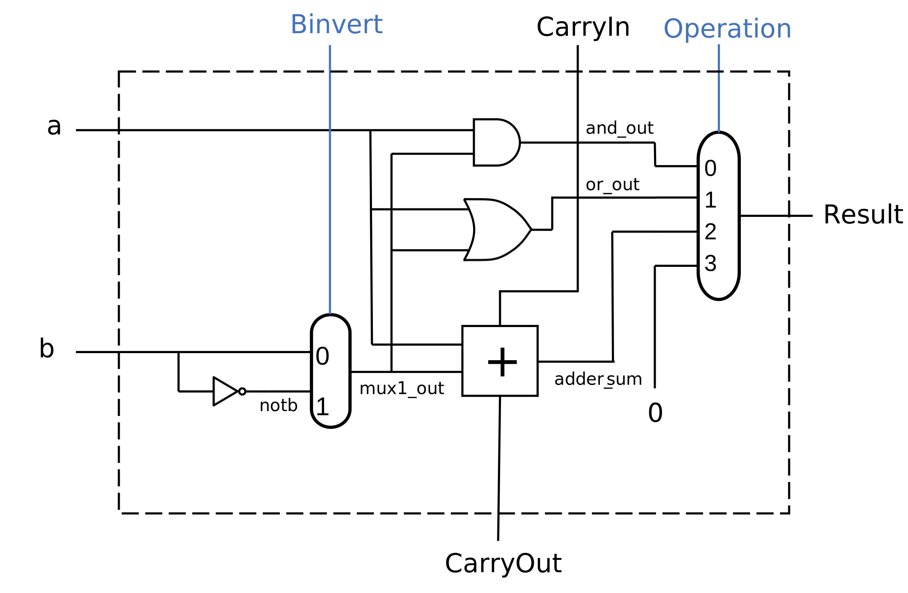

# One-bit ALU

*Due Date: Submit the report in HuskyCT by the end of Sunday, 3/20/2022*

As always, try to complete the assignment in the lab session. 

We set the deadline to the end of the spring break, to give students
flexibility. 

*If you work on computers in the learning center or on a UConn virtual desktop, 
save your files on P drive. Otherwise, you may lose your files.*

## Learning Objectives

* Implement combinational circuit in MyHDL.

* Implement combinational circuit from logic diagram.

## Prepare

*   Lecture slides on digital circuit design. 

*   Python environment with MyHDL package installed. 

*   Study examples in `gate2.py` and `mux.py` to learn how combinational
    circuit are constructed in MyHDL. The link to the examples is in the next
    section.

### MyHDL

Please install MyHDL and run examples before the lab.

The MyHDL package installation instructions are [on this
page](https://github.com/zhijieshi/cse3666/blob/master/misc/myhdl.md).

Examples of MyHDL are [in this
directory](https://github.com/zhijieshi/cse3666/tree/master/digital-logic/myhdl).

The reference manual of MyHDL explains the data types for hardware design very
well. It also also has many exmpales.

[This page](https://github.com/zhijieshi/cse3666/blob/master/myhdl/signals.md)
explains Signals and data types we can use to store signals.

## Description

In this lab, we implement a 1-bit ALU in MyHDL. 

The circuit diagram of 1-bit ALU is shown below.  If the link does not work,
the file, `alu1.svg`, is in the same directory as this file.

The skeleton code is in `alu1.py`.  Place all logic in `alu1_logic()` function.
The function in the skeleton code does not change any output signals. 

### Steps

The code geneartes all signals in the diagram starting from those directly
dependent on the input to the output of the ALU. This is a combinational
circuit. 

Follow the steps to complete the function. Budget 5 minutes for each step. 

1.  Study the diagram. All signals are named. Identify internal signals.
    Internal signals are signals generated in the module (ALU), and used only
    in the module. For example, `notb` and `mux1_out` are internal signals.

    **List all internal signals in your report**.

    Why do we need to identify internal signals? In our code, we do not keep
    internal signals in MyHDL Signal class because they do not affect other
    modules/functions.

    In later labs, you may have to name signals yourself. Do **NOT** use the
    same name for different signals.  

    Note that the output of the AND gate, the OR gate, and the adder (including
    carrayout) are always generated by hardware. They do not depend on the
    operation signal.

2.  Write code to generate `mux1_out`. We use if-else statement in Python.
    Since `mux1_out` is an internal signal, it is not a MyHDL Signal class.
    We keep it in a variable of int/bool type in Python. For example, 

        notb = not b
        mux1_out = ...

    Note that we can use MyHDL Signal type directly in an expression, as in
    `not b`.

    Examples in `mux.py` show several ways to implement a multiplexor.
    Implementation 1 uses an if-else statement. The difference here is
    `mux1_out` is not an object of MyHDL Signal class. It is an int/bool.

3.  Write code to geneate signals `and_out` and `or_out`. These are internal
    signals, too.

    We may use Python logical operators like `and` and `or`, or bitwise logical
    operators like `&` and `|`. If using bitwise operators, we keep only the
    least significant bit and clear higher bits in the end.  For example, 

        notb = (~ b) & 1

    Implementation 2 in `mux.py` shows how to write logical expressions.

4.  Write code to genarte `adder_sum`. Do not use `+` in Python.  

    Lecture slides explain how a full adder can be implemented with basic
    gates. You may use XOR operaton in Python, which simplies the expression. 

    Remember to keep only the least significant bit if a bitwise operator is
    used. 

5.  Write code to genarte `carryout`. `carryout` is a Signal in MyHDL. We use the following 
    syntax to set its value.

        carrayout.next = a ... 

    The ALU always sets `carryout` even if it is only used for additon. Do not
    put this step in an if branch.

    Note that the value of `carryout` does not change immediately. That is why
    MyHDL allows us to set the **next** value of `carryout`. MyHDL updates its
    value later and then activiate modules (call functions) that depend on
    `carryout`. 

6.  Write code to generate `result`. We use if-elif-else statement in Python to
    describe the behavior of multiplexor.  Since `result` is a Signal, set its
    value with `result.next = `, in different branches.

    The multiplexor that generates `result` is controlled by `operation`. It
    has two bits. We can compare `operation` directly with integers, as shown
    below. Python converts the Signal objects to its underlying datatypes, all
    of whcih supports integer operations. 

        if operation == 0:

### Testing

The expected output is in `output.txt`. It includes the results when
`operation` is set to 0, 1, and 2. 

Individual operation can be specified with command line argument.  For example,
the following command sets the `operation` signal to 0 (for the AND operation).
Pay attention to the `carryout` signals.  

    python alu1.py 0

## Deliverables

Submit a PDF report. The report should include the following:

*   Your work for each Step.

*   Screen shots of output of the program when operation is set to each of
    0, 1, 2, and 3.  Explain why you think the output is correct. Do NOT simply
    say it is the same as the provided output. 
